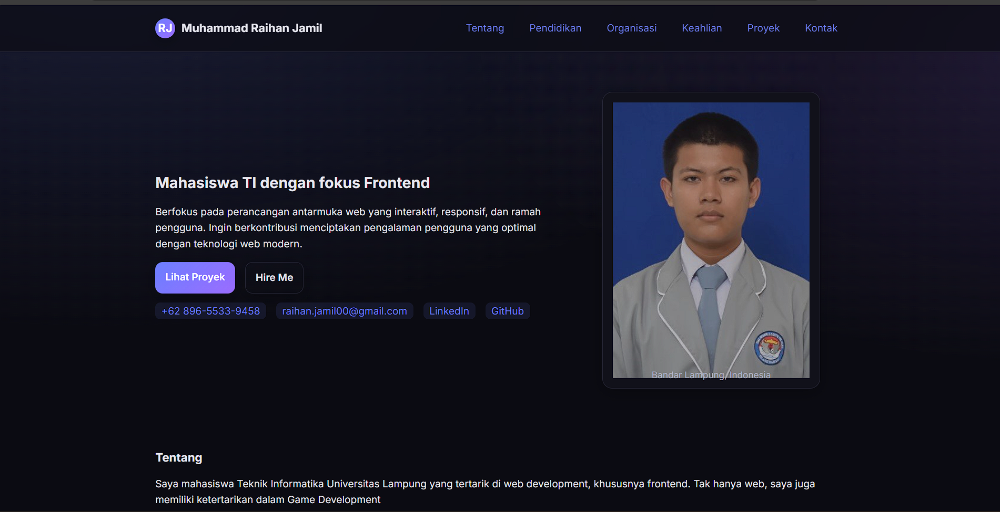
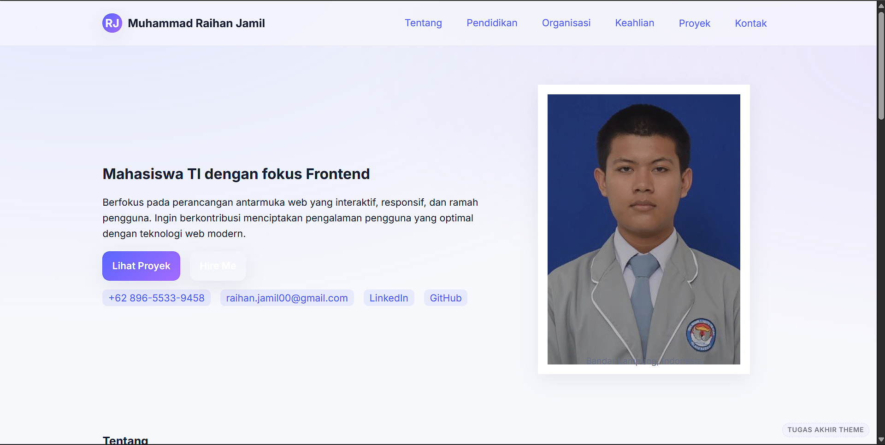

# Portofolio (Styled Tugas Akhir)

Repositori ini berisi website portofolio pribadi berbasis **HTML dan CSS** yang digunakan sebagai pemenuhan **Tugas Akhir** pada mata kuliah *Pemrograman Web*.  
Website menampilkan informasi diri, riwayat pendidikan, organisasi, keahlian, proyek, dan form kontak.  
Desain telah mengalami perubahan styling sesuai instruksi tugas akhir menggunakan tema terang, aksen warna baru, radius komponen, dan bayangan elemen.

---

## ✅ Fitur Website

- Dibangun menggunakan **HTML dan CSS murni**, tanpa framework.
- Struktur semantik web:
  - `header`, `nav`, `main`, `section`, `article`, `aside`, `footer`
- Komponen tampilan:
  - Bagian profil, pendidikan, organisasi, keahlian, proyek
  - Tabel, card, list, link eksternal
  - Form kontak dengan validasi HTML5 (`required`, `type`, `select`, `textarea`)
- Responsif dengan media query sehingga tetap rapi di device kecil.
- Aksesibilitas dasar:
  - Skip link
  - ARIA label pada navigasi dan kontak
- Print-friendly (ketika di-print menjadi format CV yang bersih)

---

## ✅ Perubahan Styling (Sesuai Tugas Akhir)

Website mengalami perubahan desain dibanding versi sebelumnya:

| Elemen | Perubahan |
|--------|-----------|
| Tema warna | Menggunakan tema terang (light) dengan aksen biru `--brand` dan ungu `--brand-2` |
| Border & Radius | Komponen memakai border lembut dan `--radius: 18px` |
| Shadow | Menggunakan `--shadow: 0 10px 32px rgba(27,35,58,.08)` pada panel dan card |
| Background | Latar belakang menggunakan 2 radial gradient untuk fokus visual |
| Indikator tugas | Terdapat watermark kecil **“TUGAS AKHIR THEME”** pada pojok layar sebagai bukti perubahan styling |

