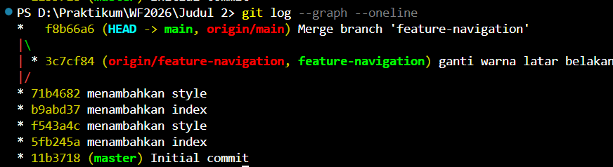

# Portofolio (Tugas Akhir Pemrograman Web)

Proyek ini adalah website portofolio sederhana yang dibuat menggunakan **HTML dan CSS tanpa framework**.  
Isi utamanya menampilkan data diri, pendidikan, pengalaman organisasi, keahlian, serta beberapa contoh proyek.  
Ada juga form kontak sebagai simulasi pengiriman pesan.

Sebagai bagian dari **Tugas Akhir**, tampilan website diperbarui menggunakan tema terang, penyesuaian warna, sudut komponen dibuat lebih halus, dan diberi efek bayangan agar elemen terlihat lebih rapi.

---

## Fitur

- Tampilan dibuat dengan HTML dan CSS murni  
- Struktur halaman memakai elemen semantik  
- Layout responsif, tetap nyaman dilihat di ukuran layar kecil  
- Form kontak dengan validasi HTML bawaan  
- Cocok untuk di-print sebagai CV satu halaman
- Navigasi sederhana, ringan, dan cepat diakses

---

## Perubahan Styling

| Bagian | Perubahan |
|--------|-----------|
| Tema Warna | Beralih ke tema terang dengan aksen biru dan ungu |
| Border & Radius | Elemen memiliki sudut lebih lembut (border-radius 18px) |
| Shadow | Panel dan card mendapat efek bayangan halus |
| Background | Menggunakan radial gradient agar tidak polos |
| Penanda TA | Menambahkan watermark kecil sebagai penanda tugas akhir |

---

## Dokumentasi

Tampilan sebelum dan sesudah perubahan:

  

Contoh hasil `git log --graph --oneline`:

---

## Cara Menjalankan

1. Clone atau download repository ini  
2. Buka file `index.html` menggunakan browser  
3. Tidak memerlukan server tambahan atau instalasi library

---

## Catatan

Repository ini dibuat untuk memenuhi tugas mata kuliah Pemrograman Web, sekaligus latihan membuat website portofolio sederhana menggunakan HTML dan CSS murni.

Jika ingin menambah fitur atau memperbaiki tampilan, cukup ubah `index.html` dan `styles.css`.

